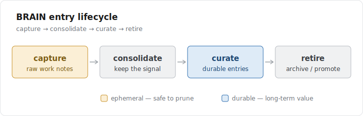

# BRAIN Architecture

BRAIN is a filesystem-based, git-friendly, model-agnostic memory layer. The whole
point is that it's just markdown in folders — readable by any human and any model,
versioned by git, with no database to run.

## Directory layout

```
BRAIN/
├── INDEX.md          # auto-generated entry point (run build_index.py)
├── README.md         # what this BRAIN is
├── QUICK-REFERENCE.md
├── checkpoints/      # mid-session progress snapshots (ephemeral)
├── sessions/         # session retrospectives
├── decisions/        # why we chose X over Y (durable)
├── bugs/             # hard cases and fixes (durable)
├── learnings/        # extracted insights (durable)
├── patterns/         # reusable patterns (durable)
└── handoffs/         # cross-model transfer documents
```

## The entry lifecycle

Entries are not just dumped and forgotten — they move through a lifecycle. Capture
is cheap and high-volume; consolidation keeps the signal; durable knowledge gets
curated; stale entries are retired (not deleted).



This lifecycle is expressed through the `status` field in each entry's
[frontmatter](./FRONTMATTER.md) — **not** through moving files into new folders.
The flat layout stays portable; the index does the sorting.

## INDEX.md — the read path

Instead of re-scanning the whole tree every time you want to know the current
state, `BRAIN/INDEX.md` is a single generated file with:

- a **current state** header (latest handoff, last checkpoint, active/retired counts)
- **active knowledge** grouped by type, newest first
- a **retired** section for superseded/archived entries, kept out of the way
- a **needs frontmatter** hygiene list for legacy entries

Regenerate it any time:

```bash
python .claude/skills/brain-ops/scripts/build_index.py /path/to/project
```

It has zero external dependencies and degrades gracefully: entries without
frontmatter are still indexed (by folder + filename) and flagged for migration.

See [`examples/sample-project/BRAIN/INDEX.md`](../examples/sample-project/BRAIN/INDEX.md)
for a generated index over a real worked example.

## What's next

This is **Fala 1** (frontmatter + index) of the BRAIN evolution. Next comes the
backlink graph (`links:` → "referenced by"), then a global `~/BRAIN/` layer for
universal patterns, then semantic search once volume justifies it. See
[ROADMAP.md](./ROADMAP.md).
